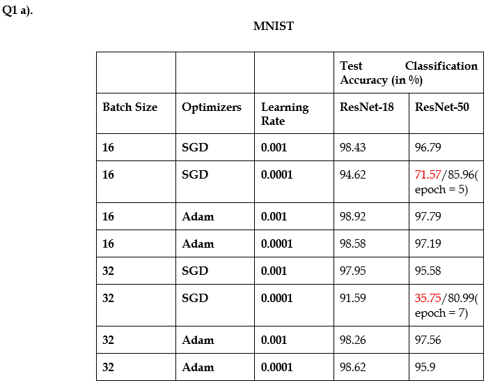
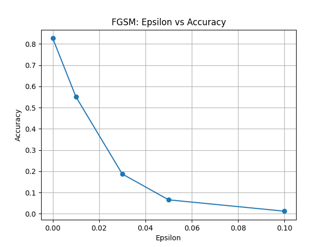
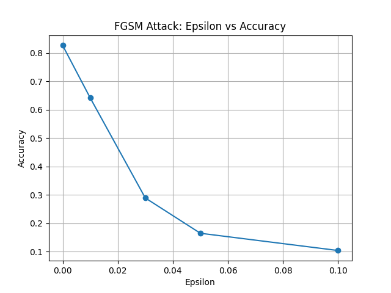
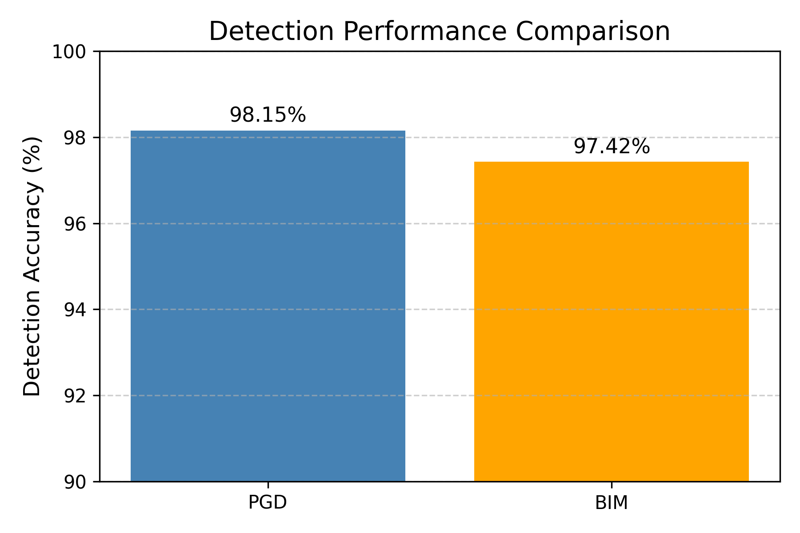
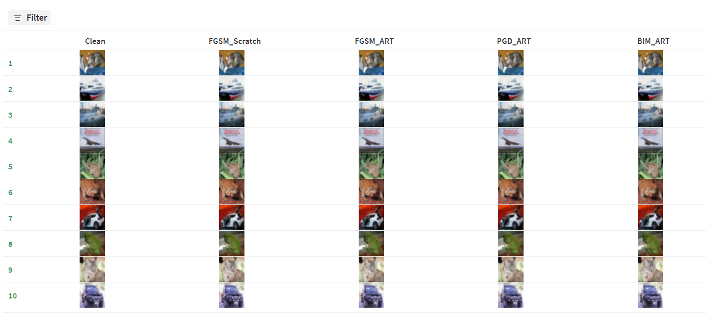

------------------------------ Problem 1 ---------------------------------------------------

1. How to install dependencies: pip install -r requirements.txt
2. How to train: python src/train_vit.py - for baseline model
python src/train_lora.py - for LoRA injection
3. How to evaluate: python src/evaluate_best_model.py
4. to count the baseline params: python src/count_params_baseline.py

HuggingFace link - https://huggingface.co/Apollo112/vit-small
WandB link - https://wandb.ai/m25csa024-prom-iit-rajasthan/dlops-assignment-5/workspace?nw=nwuserm25csa024

results - best model Rank: 8, Alpha: 8

| Epoch    | Training Loss | Validation Loss | Training Accuracy | Validation Accuracy |
|----------|---------------|-----------------|-------------------|---------------------|
| 1        | 3.3640        | 2.6510          | 0.3123            | 0.4883              |
| 2        | 2.3093        | 2.0707          | 0.5657            | 0.6134              | 
| 3        | 1.8760        | 1.7509          | 0.6633            | 0.6807              | 
| 4        | 1.6089        | 1.5511          | 0.7212            | 0.7150              |  
| 5        | 1.4287        | 1.4135          | 0.7546            | 0.7435              | 
| 6        | 1.2973        | 1.3209          | 0.7784            | 0.7593              | 
| 7        | 1.1963        | 1.2506          | 0.7975            | 0.7642              | 
| 8        | 1.1137        | 1.1862          | 0.8125            | 0.7813              | 
| 9        | 1.0461        | 1.1398          | 0.8247            | 0.7879              | 
| 10       | 0.9908        | 1.1033          | 0.8350            | 0.7926              | 

------------------------------ Problem 2 ---------------------------------------------------

1. How to install dependencies: pip install -r requirements.txt
2. How to train: a) python src/train_resnet.py - for resent-18 training
python src/fgsm_attack.py - for FGSM attack (without ART)
python src/fgsm_art.py - for FGSM attack (with ART)
python src/adversarial_detection_pgd_art.py - for PGD attack (with ART)
python src/adversarial_detection_BIM_art.py - for BIM attack (with ART)
3. How to evaluate: python src/evaluate_best_model.py
4. to count the baseline params: python src/count_params_baseline.py

WandB link - https://wandb.ai/m25csa024-prom-iit-rajasthan/dlops-ass5-q2-adversarial-detection?nw=nwuserm25csa024

FGSM results - 

|epsilon  | accuracy |
|---------|----------|
| 0.0     |  0.8264  |
| 0.01    |  0.551   |
| 0.03    |  0.1873  |
| 0.05    |  0.0655  |
| 0.1     |  0.012   |

FGSM-art results - 

|epsilon  | accuracy |
|---------|----------|
| 0.0     |  0.8264  |
| 0.01    |  0.6416  |
| 0.03    |  0.2889  |
| 0.05    |  0.1645  |
| 0.1     |  0.103   |

detection comparison b/w PGD vs BIM - 

10 samples for clean and adversarial images created using FGSM (with and without IBM ART), PGD, and BIM attacks - 

The 10 samples for clean and adversarial images created using FGSM (with and without IBM ART), PGD, and BIM attacks can be found on the WandB link.
 
